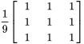

#Introduction

Computer vision is the study of how computers can understand digital visual information, like images and videos. Through the use of computer vision we can automate many tasks that the human visual system can do naturally. In this guide, I will use Python when explaining the code parts of computer vision, becuase it is easy to read and most programmers know it. 

Computer vision's understanding of the data can be split into three categories: low, medium, and high. Low level computer vision is at the pixel level and includes image resizing, edge finding, and color segmentation. Medium level computer vision is image level and includes panorama stiching, optical flow, and stereo depth perception. High level computer vision is at the semantic level and includes image tagging, object detection, and instance segmenation. 

#Human Vision

The ability for organisms to percieve light has been around essentially ever since creatures were able to move around. First organisms evolved eyespots, then pit eyes, then finally complex eyes. Acuity. On top of having complex eyes, humans also have the abilty to change their refraction which allows us to focus. Rods and cones. How we percieve depth. Fovea. Eyes need movement to see. Fixational eye movement. Human colorspace. Our trichromancy and what colors we percieve stronger. Some things easy for human vision is difficult for computer vision and vise versa.

#Image Basics

-what is an image
-lens basics: lens, focal length, ...
-cartesian vs computer screen coords 
-color images to a computer algorithm is a 3d tensor
-row major vs column major
-HWC vs CHW
-Triangle, bilinear, and bicubic interpoliation

An image is when a 3D space is projected onto a 2D plane.

#Resizing 

-how to make smaller
-how to make larger
-artifacts with bilinear and bicubic interpolation

#Kernels

Kernels in computer vision is a small matrix convolved over an image to do a number of useful changes, for example, blurring, sharpening, and edge detection. The convolution with the kernal over an image is done by mulitplying its weights on each possible pixel of the image with a stride of 1. Unless you add in padding before the kernal convolution, it will result in N-1 smaller image. For example, a 3*3 kernal passed over a 16*16 image would result in a 14*14 sized image. Kernels which have even sized dimentions, for example 2*2 or 4*4, give bad results and therefore are never used.

In the example below, you can see how an edge detection kernel convoled over a 16*16 image is calculated. The edge detection filter we are going to use is:

 

|Step #|Multiplication On Image            |Resulting Pixel                        |Output Image                       |
|------|-----------------------------------|---------------------------------------|-----------------------------------|
|1     |  |  |  |
|2     |  |  |  |
|...   |...                                |...                                    |...                                |
|14    ||||

**Types of Kernels**

|Name                     |Kernel|Result|Description                            |
|-------------------------|------|------|---------------------------------------|
|Identity                 |||Does nothing except for shrink the resulting image's height and width down by 2 pixels.|
|Box Blur                 |||Filters out high frequency details out an image, but this usually in practice Gaussian blurs are used.  |
|3*3 Guassian Blur        |||Filters out high frequency details out of an image.|
|5*5 Guassian Blur        |||Filters out more high frequency details out of an image.|
|Sharpening               |||Increases the sharpness of the pixels in the image.|
|0 Centered Edge Detection|||Filters out low frequency details out of an image|
|4 Centered Edge Detection|||Filters out more low frequency details out of an image|
|8 Centered Edge Detection|||Filters out even more low frequency details out of an image|

##LoG and DoG Filters

**WRITE THIS NOT FOR AWHILE. I NEED TO DECIDE ON BLOB DETECTION FIRST**

|Filter                 |Image                |
|-----------------------|---------------------|
|Original               |          |
|Simple Edge Detection  ||
|Lapacian of Gausians   |  |
|Difference of Gaussians|  |

##Sobel Edge Detection

Sobel edge detection is an algorithm which is used in computer vision to find not only the edges in an image, but also the edges' magnitude in direction. We do this by using the vertical and horizontal edge kernels. By finding the hypotenuse of the vertical and horizontal edges, we get the edges' magnitude. By plugging the vertical and hortizontal  edges into atan2(), we get the edges' direction. The edge detection is between 0 and 180&deg;.

As an example, let us apply Sobel Edge Detection to the following image:

|Input(s)                                      |Operation                |Output                             |
|----------------------------------------------|-------------------------|-----------------------------------|
|                         ||          |
|                                              |                         |Formally we call this Gx|
|                         ||          |
|                                              |                         |Formally we call this Gy|
||          |      |
||      |  |

By visualizing the x angle, 90&deg;, with a red hue and the y angle, 0&deg;, with a blue hue, and the magnitude of the edge with the value, we get the following image:

#Features

In computer vision, a feature is any piece of information on an image that is relevent to the problem we are trying to solve. Common features to look for are edges, blobs, and corners.

##Edge Detection

Edge detection is any mathematical method that aims at identfying edges or curves in an image at which the image brightness changes sharply. The most common algorithm used for modern edge detection is the "Canny edge detector". It works in the following five steps:

1. Reduce noise using a gaussian filter

    Edge detection is very sensitive to noise so we apply a gaussian filter with the size we feel works best. In the example below I applied a 5 * 5 filter.

    

2. Find the intensity gradients of the image

    Second we want to find the intesity gradients of the image. We do this by applying the vertical edge detector and the horzonatal edge detector to make two separate matrices. Using these two matricies we find the magnitudes of the edges via the hypotenuse function and the angles of the edges via the arctan() function.

    
*Angles*

    
*Magnitudes*

3. Apply non-max supression to thin the egdes

    Next, we want to thin the edges. We do this by comparing each pixel's magnitude to the magnitude of it's neighbor's pixels in the same direction as it's angle. If the pixel has the largest magnitude compared to its neighboors, it remains the same, if not we set its magnitude to zero. For example, if a pixel has a vertical angle we compare it's magnitude to the pixel above and below it.

    

4. Double threshold to filter pixels into three categories

    After thinning the edges, we want to split the pixels into three categories: strong, weak, and very weak. To do this we set two thresholds: one as the minimum threshold to be considered a "strong" pixel and another to be considered a "weak" pixel. Any pixel who's gradient value is greater than the first threshold is kept in the final output. Any pixel between the two thresholds is a weak pixel and may or may not be in the final output. Any pixel below both thresholds will not be in the final output.

    
    *Strong pixels in red, weak pixels in green, and very weak pixels in black*

5. Perform hysterious to filter pixels into two categories

    The last step is deciding which of the weak pixels from the last step to keep. If a "weak" pixel has a strong neighbor as one of its 8 immediate neighbors (North, South, East, West, North-East, etc), it is kept in the final output and if it doesn't it is considered noise and it is removed.

    

##Blob Detection

Blob detection in computer vision are methods used to detect contiguous regions of an image that are differ in properties, like color or brightness. When using a high pass filter to find places of difference in images, sometimes this can result in the high frequency noise being amplified. For this reason we have the LoG (Lapacian of Guassians) and DoG (Difference of Gaussians) filters. Both of these filters are shaped similar to Mexican hats and are used for finding regions of difference in an image without amplying the noise. **THIS NEEDS TO BE REWRITTEN AFTER NEARLY EVERYTHING ELSE IS DONE**.

##Corner Detection
Corners in images are very nice to know in computer vision because they have high self-difference and therefore are likely unique to that section of the image. Which directionever we move the image patch it is different to its proximal patches. If we keep track of only the corner patches, we can significantly improve algorithms for video tracking, panorama stitching, etc. A 1920 by 1080 image has ~2 million 11 by 11 patches, but a corner detection algorithm could cut that down to 100 or however much you need patches. 

Lets use the following image of a square to demonstrate why use corners for features we track:

 

|Type of Patch  |Picture                                |Moved Right                              |Moved Up                               |Self-Difference|
|---------------|---------------------------------------|-----------------------------------------|---------------------------------------|---------------|
|No Edges       ||  ||Terrible       |
|Horizontal Edge|          ||    |Okay           |
|Vertical Edge  |        |    |     |Okay           |
|Corner         |    || |Great          |

The best algorithm for this introduced in 1988 was the Harris corner detector, then in 1994 a slight modification to this algorithm that dramatically improved results is the Shi-Tomasi algorithm. The Shi-Tomasi algorithm is so good its function in the CV2 library is called "goodFeaturesToTrack()".

|                       |Image                |
|-----------------------|---------------------|
|Original               |          |
|Harris-Corner Detection||
|Shi-Tomasi             |      |

##Feature Descriptors

A feature descriptor is any algorithm which takes in an image and outputs a list of features that encode interesting information about an image.

###SIFT (Scale Invariant Feature Transform)

SIFT is a patented 

###HOG (Histogram of Gradients)

The HOG algorithm splits an image into a grid and then finds the average gradient of each cell. HOG combined with a SVM (Support Vector Machine) before neural networks was one of the best methods of object detection. How it works is that after splitting the image into cells, a histrogram of the direction of each cell's gradients are calculated and the most common gradient in that cell is chosen. In order to account for the changes in illumination and contrast, we can perform "block normalization" where we have each histogram be relative to its neighboring blocks. 

|                      |Image                  |
|----------------------|-----------------------|
|Original image        |            |
|Image split into cells||

|      |Image                    |Magnitude and Gradients                    |Histogram                          |Output                           |
|------|-------------------------|-------------------------------------------|-----------------------------------|---------------------------------|
|Cell 1|||||
|Cell 2|||||
|...   |...                      |...                                        |...                                |...                              |

The following is the HOG features on an image before normalization:

|      |Image                    |Histogram                          |Neighbors                          |Neighbor Histogram                           |Histogram Normalized                         |Normalized Output                          |
|------|-------------------------|-----------------------------------|-----------------------------------|---------------------------------------------|---------------------------------------------|-------------------------------------------|
|Cell 1|||||||
|Cell 2|||||||
|...   |...                      |...                                |...                                |...                                          |...                                          |...                                        |

The following is the final output of the HOG algorithm:

###ORB

#Example Problem: Stitching Together a panorama

-RANSAC
-homography 
-cylinder projection

#Optical Flow

-sparse vs dense
-problems with feature tracking
-lucas kanade
-aperature problem
-image pyramids
-farneback 

#Depth 

-we percive depth: binocoluar covergence, bi parallax, monocular movement parallax, image cues
-computers percieve depth: stereo cameras, lidar, structured light, time of flight
-depth is used for object seg, 3d reconstruction, facial regoniztion, pose tracking

##Stereo depth
-persepective projection 
-camera intrinsics
-how to solve for depth with stereo camera
-graph cut
-assumptions which are pitfalls: uniqueness, ordering, and smoothness

2021 Colin McGovern. Feel free to copy.

